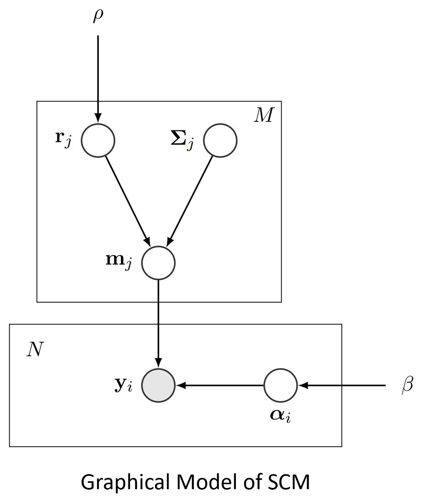
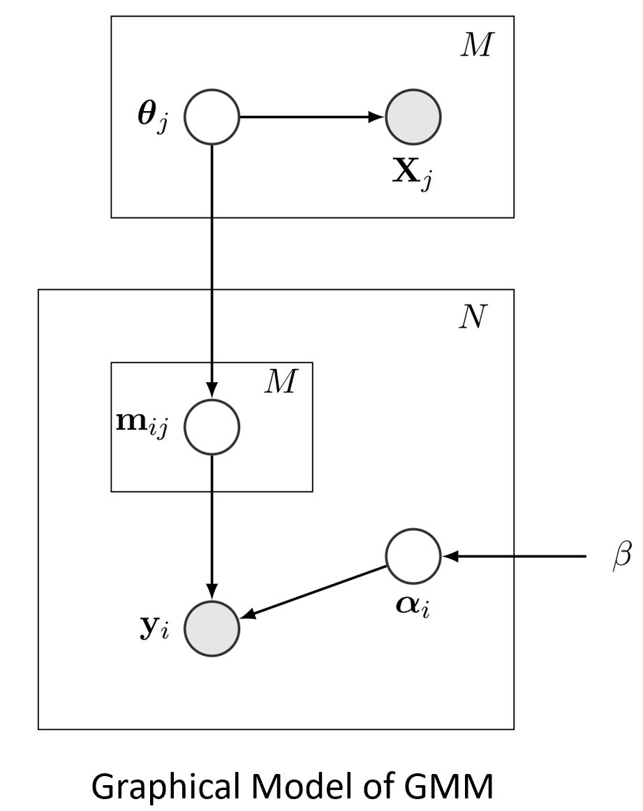
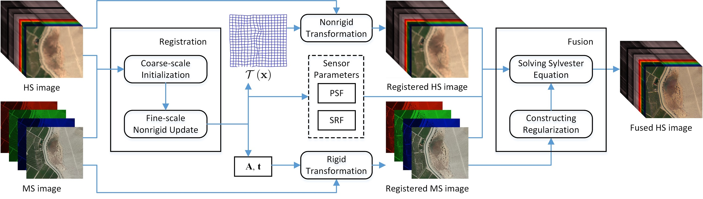

# Statistical Spectral Unmixing Toolkit
Yuan Zhou

## Introduction

Hyperspectral images, a kind of images with hundreds of bands covering a wide spectral range, typically have a low spatial resolution. Given a pixel covering a region with a diameter of several meters, an interesting question is what the composing materials are and what their fractions are in the region. Finding the spectral signatures of these underlying materials (*endmember*) and their fractions (*abundance*) in each pixel is called *spectral unmixing*. In practice, spectral unmixing is used to study the composition of surfaces on Earth.    

Given an image to unmix, spectral unmixing can be acomplished in three ways: (1) Assume that there is a fixed set of endmembers and all the pixels are linear combinations of them; (2) Assume that there is a spectral library of pure spectra representing *endmember variability* for a set of *endmember classes*, and that the pixels to unmix are linear combinations of some spectra in the library; (3) Assume that there is an additional color or multispectral image that covers the same area, and the underlying compostion can be retrieved by registering the fusing these two types of images.

This repository contains the Matlab implementations of several algorithms on this topic, including:  

	1. Spatial compositional model (SCM) for unmixing with a fixed endmember set (TIP16)  
	2. Gaussian mixture model (GMM) for unmixing with endmember variability (TIP18)  
	3. A registration and fusion algorithm for combining a hyperspectral image and a multispectral image (TGRS19)  
	4. Application of GMM to a Santa Barbara dataset (RSE20)

If you find some of the code helpful, please cite the corresponding papers.  

Zhou, Y., Rangarajan, A. & Gader, P. D., A spatial compositional model for linear unmixing and endmember uncertainty estimation. IEEE Transactions on Image Processing, vol. 25, no. 12, pp. 5987-6002, 2016  
(http://ieeexplore.ieee.org/document/7592431/)  

Zhou, Y., Rangarajan, A. & Gader, P. D. A Gaussian mixture model representation of endmember variability in hyperspectral unmixing. IEEE Transactions on Image Processing, vol. 27, no. 5, pp. 2242-2256, 2018  
Zhou, Y., Rangarajan, A. & Gader, P. D., A Gaussian mixture model representation of endmember variability in hyperspectral unmixing. IEEE Transactions on Image Processing, vol. 27, no. 5, pp. 2242-2256, 2018  
(http://ieeexplore.ieee.org/document/8264812/)  

Zhou, Y., Rangarajan, A. & Gader, P. D., An integrated approach to registration and fusion of hyperspectral and multispectral images, IEEE Transactions on Geoscience and Remote Sensing, vol. 58, no. 5, pp. 3020-3033, 2020  
(https://ieeexplore.ieee.org/document/8897135)  

Zhou, Y., Wetherley, E. B. & Gader, P. D., Unmixing urban hyperspectral imagery using probability distributions to represent endmember variability, Remote Sensing of Environment, vol. 246, 2020  
(https://doi.org/10.1016/j.rse.2020.111857)  

#### Organization

The folder "common" contains common functions that will be used by all the algorithms.  

The folder "SCM" contains functions that implement the spatial compositional model.  

The folder "GMM" contains functions that implement the Gaussian mixture model for spectral unmixing.  

The folders "REG" and "Fusion" contains functions that implement the registration algorithm and the fusion algorithm for hyperspectral and multispectral images.  

The folder "GMM_SantaBarbara" contains code of methods used in the application paper. It uses the functions in the "GMM" folder to run the GMM algorithm.  

## Spatial Compositional Model

In SCM, we add a layer of a fixed set of endmembers that generate all the pixel spectra. Integrating out this layer requires first combining all the pixel spectra likelihood. In this way, the estimated covariance matrices reflect a kind of uncertainty about the endmember centers.  


To see the demo, run
```
test_scm;
```

The "dataset" in it can be changed.  

The SCM function is used as follows: 

function [A,R,mu,sigma,var_dirs,var_amts] = scm(I,M,options)  
Input:  
  I: row*col*B image data,  
  M: number of endmembers,  
  options: structure for additional parameters,  
Output:  
  A: abundances (N by M),  
  R: endmembers (M by B),  
  mu: noise standard deviations,  
  sigma: covariance matrices of endmember uncertainty,  
  var_dirs: uncertainty directions,  
  var_amts: uncertainty amounts.  

Note: options is a structure containing eta,beta1,beta2,rho1,show_figure,init_mode, etc.  

#### Organization

The "SCM" folder contains the main files for the unmixing algorithm with uncertainty estimation. The "common" folder contains auxiliary files used for displaying and processing. 


## Gaussian Mixture Model

In GMM, we are given a spectral library of pure spectra for all the endmember classes. This spectral library confines the range of endmember spectra that are allowed in a pixel. We first estimate the GMM parameters given this library, then estimate the abundances in each pixel.  


There are two versions. The first version (unsupervised) first segments the image, uses the interior pixels of the segmented regions to build distribution parameters, and finally updates the abundances. To run the demo code of this version, run  
```
test_gmm;
```

The second version (supervised) takes a library of spectra as input and outputs the abundances. To run this version, run  
```
test_gmm_ex;  
```

#### Organization

The "GMM" folder contains the files for the unmxing algorithm with endmember variability modeled by GMM. There are two demo files.  

"test_gmm.m" - demo file that runs the unsupervised GMM algorithm, which is implemented in "gmm_hu.m". It also calls "gmm_hu_endmember.m" which estimates pixelwise endmembers.  

"test_gmm_ex.m" - demo file that runs the supervised GMM algorithm (implemented in "gmm_hu_ex.m"). It also calls "gmm_hu_endmember.m" to estimate pixelwise endmembers.  

## Registration and Fusion

The registration algorithm applies a nonrigid transformation to the hyperspectral image and a rigid transformation to the multispectral image. The fusion algorithm uses the linear coefficients learned from the manifold of the multispectral pixels to constrain the reconstructed hyperspectral pixels.



The following code is used to perform registration on the sample images of the Salton Sea site. The results will be shown in a GUI for checking registration accuracy.  
```
cd REG
test_reg;
```
To perform fusion, switch to the fusion folder and run the demo code. The test images are from the Gulfport dataset. The fused image will be shown in a GUI for checking the spectra.  
```
cd ../Fusion
run_fusion_algo;
```

#### Organization

The "REG" folder contains the files for registration of hyperspectral and multispectral images.  

"test_reg.m" - demo file that runs the registration algorithm, which can handle images with different spatial and spectral resolutions.  

"reg_hyper_rgb.m" - main file that implements the registration algorithm.  


The "Fusion" folder contains the files for fusion of hyperspectral and multispectral images.  

"run_fusion_algo.m" - demo file that runs the fusion algorithm.  

"im_fusion.m" - main file that implements the fusion algorithm.  

## Application of GMM to Santa Barbara data

It is difficult to evaluate unmixing algorithms since the endmembers can be interpreted in many ways. One approach is to fix the endmembers and evaluate the abundances by comparing them to some reference values retrieved from coregistered high-resolution images. The Santa Barbara dataset has 64 validation polygons with 2 spatial resolutions (16 m, 4 m), where the true abundances are estimated by referring to 1 m images. It also provides a spectral library that collects a large number of spectra for 6 endmember classes, turfgrass, NPV, paved, roof, soil, tree. By applying multiple unmixing algorithms on this dataset, accuracy can be evaluated and compared.  


To run any unmixing algorithm on the data, run the following code.  
```
run_end_var_algos;
```

#### Organization

The "GMM_SantaBarbara" folder contains the implementation of multiple methods (AAM, GMM, GMM-1, NCM Sampling, BCM) for unmixing the Santa Barbara dataset. The implementation of MESMA is available in the Viper Tools (https://sites.google.com/site/ucsbviperlab/viper-tools) by the original authors.  

"run_end_var_algos.m" - demo file that runs the unmixing algorithms. It needs to access the functions in the "GMM" folder to run the GMM algorithm.  

"prepare_data.m" - loads the Santa Barbara dataset.  


## Contact

If you have any questions, please contact:

Yuan Zhou  
Department of Computer and Information Science and Engineering  
University of Florida  

zhouyuanzxcv@gmail.com

